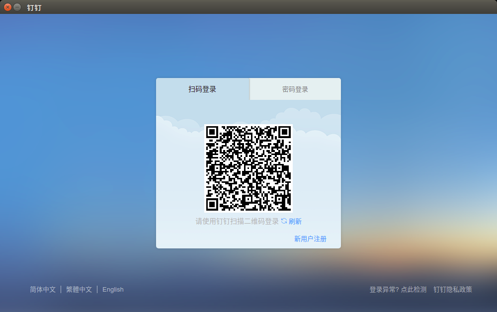

# Dingtalk for Linux

Dingtalk for Linux-x64.


# Introduction

## QRCode lgin



## Chat session


## Installation

Enter 'Enter' to use default installation position

```
# Step 1.
$git clone git@github.com:monitor1379/Dingtalk-for-Linux.git

# Step 2.
$cd Dingtalk-for-Linux

# Step 3.
$sudo ./install.sh
```

```
============================================
Welcome to install Dingtalk for Linux

Install to (/opt/dingtalk): 

Install position: /opt/dingtalk

Installing...
Create: /opt/dingtalk
Copy: src/ to /opt/dingtalk/src
Copy: lib/ to /opt/dingtalk/lib
Copy: dingtalk.sh to /opt/dingtalk
Create: /usr/share/applications/dingtalk.desktop

Done
============================================

```

# Uninstallation

```
cd path/to/dingtalk
sudo ./uninstall.sh
```
